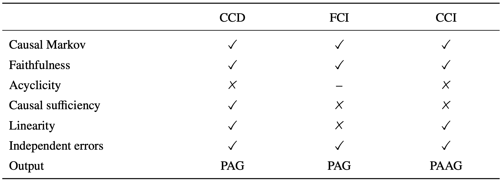
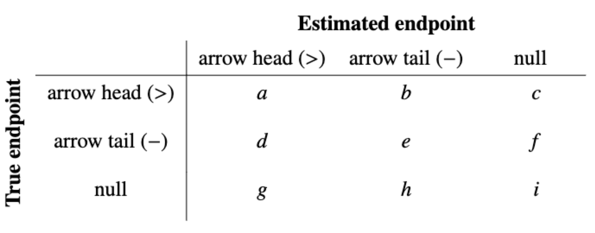
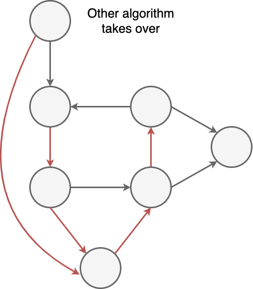

## Network Theory in Psychology

Mental disorder is produced by direct causal interactions between symptoms that reinforce each other via feedback loops. [@BorsboomCramer2013].

::: r-stack
{.fragment fig-align="center" width="450"}

{.fragment fig-align="center" width="450"}

{.fragment fig-align="center" width="450"}

{.fragment fig-align="center" width="450"}

{.fragment fig-align="center" width="450"}

{.fragment fig-align="center" width="450"}

{.fragment fig-align="center" width="450"}

{.fragment fig-align="center" width="450"}

{.fragment fig-align="center" width="450"}
:::

::: notes
To give you a bit context on why my topic is actually interesting. In psychology, we have this network theory which has become very popular lately. What it says, is basically that the mental disorder is produced by causal interactions between symptoms.

As you can see here, feeling down makes you sleep poorly and lack of sleep makes you feel tired the next day and it sorta becomes this vicious cycle and that manifests as a depression, that's what the theory says.
:::

## Inferring causality from observational data

<!-- ::: notes -->

<!-- Hi, welcome to the grand opening of the masters' thesis presentation. I am Kyuri, I am honored to be the first to give you the quick intro of my project. As you can see in the title, the topic of my project is discovering cyclic causal model using observational data in Psychology, which is my background -->

<!-- ::: -->

::: notes
And what has happened a lot in psychology is that many empirical researchers try to gain insights into this causal relationships by fitting this statistical network model using observational data. \[Alt + click!\] But these connections in the network are merely statistical relations, which cannot be directly translated into causal relations.

And more and more people have become aware of that, and there has come another popular modeling tool, which is DAG. DAG stands for directed acyclic graphical model. And it is specifically designed to make causal inference based on the observational data.\[Alt + click!\] It has all these arrows you can interpret as a cause and effect. It seems very promising, however, one of biggest shortcomings of DAG is by definition it does not allow cycles. But as we saw before, the true system contains cycles. In that sense, we cannot really use DAG to estimate the real underlying mechanism. So what do we need to do?
:::

::: {.cell}

:::

::: columns
::: {.column width="50%"}

::: {.cell}
::: {.cell-output-display}
{width=960}
:::
:::

:::

::: {.column .fragment width="50%"}

::: {.cell}
::: {.cell-output-display}
{width=960}
:::
:::

:::
:::

------------------------------------------------------------------------

##  {background-image="img/bg_sl2.png"}

::: columns
::: {.column .r-stretch width="10%"}
:::

::: {.column .r-stretch .fragment .semi-fade-out width="45%"}
Directed Acyclic Graph (DAG)

::: {.cell}
::: {.cell-output-display}
{width=960}
:::
:::

:::

::: {.column .r-stretch .fragment .grow width="45%"}
Directed Cyclic Graph (DCG)

::: {.cell}
::: {.cell-output-display}
{width=960}
:::
:::

:::
:::

  

::: {.fragment style="line-height: 1.5;"}
[Problem]{style="color:#cc0000; font-weight: bold"}: Estimating a cyclic causal model is fundamentally very difficult. Relaxing the acyclicity assumption entails much of theoretical complication.\
:::

::: notes
We need to look at directed cyclic graph model, instead of DAGS. You might wonder then, why do people not use this already? Why are they even bothered using DAGs which cannot handle cycles?

Well, the answer is because estimating cyclic causal models is basically very difficult. Long story short, relaxing the acyclicity assumption comes with a lot theoretical complications.
:::

------------------------------------------------------------------------

## Solutions exist {background-image="img/bg_sl3.png"}

-   Cyclic Causal Discovery (CCD) [@richardson1996]

-   Fast Causal Inference (FCI) [@mooij20a]

-   Cyclic Causal Inference (CCI) [@strobl2019]

::: notes
Despite all those difficulties, there has been some solutions suggested in the past. called CCD, cyclic causal discovery method. FCI, fast causal inference method. And CCI, cyclic causal inference.
:::

## Solutions exist, [but...]{style="color:#cc0000"} {background-image="img/bg_sl3.png"}

{fig-align="center"}

::: {.fragment style="text-align: center"}
PAG: *Partial Ancestral Graph* ?\
PAAG: *Partially-oriented MAAG* ?\
MAAG: *Maximal Almost Ancestral Graph* ?
:::

::: notes
But unfortunately, these solutions are also complicated. Each of these solutions come with all different sorts of assumptions as you can see in this table. And especially their resulting graphs, which are called PAG, and PAAG with double A. And they are not that straightforward: it is not clear what the connections mean and how we can actually interpret them.
:::

------------------------------------------------------------------------

## Project goals {background-image="img/bg_sl33.png"}

 

::: {style="line-height: 2.3;"}
1.  Give an [accessible overview]{.fragment .highlight-current-red} of the algorithms  
2.  Investigate the [performance]{.fragment .highlight-current-red} of each algorithm  
3.  Apply to the [empirical]{.fragment .highlight-current-red} data
:::

::: notes
So there comes our project finally. Accordingly, the aim of our project is threefold. First, we'd like to provide an ACCESSIBLE overview of these algorithms that I just introduced. And secondly, we want to investigate how well each of these algorithms work by means of a simulation study. And lastly, we want to test them on the empirical data. So, we can get some idea on the actual applicability in practice.
:::

------------------------------------------------------------------------

## Example

{fig-align="center" style="width: 1100px;"}

<!-- ## Comparison metrics {background-image="img/bg_sl4.png"} -->

<!-- (top algorithm applies to empirical data) -->

::: notes
Here is a quick example. What I will do in my siumation study. So I will generate the data from a true cyclic graph. And try to estimate that cyclic model with each of these algorithms. In the end, I will try to compare them based on the recovery rate, so how well they can retrieve the true model.
:::

------------------------------------------------------------------------

## Summary {background-image="img/bg_sl5.png"}

 

::: {style="font-size: 1.1em; line-height: 1.3;"}
-   [Causal inference]{.fragment .highlight-red} is the fundamental interest in science.

-   The underlying dynamic processes of many systems [contain cycles]{.fragment .highlight-red}.

-   Learning [cyclic causal models]{.fragment .highlight-red} from observational data is challenging.

-   Our study will showcase the [cyclic causal discovery algorithms]{.fragment .highlight-red} that are potentially suitable for typical psychological observational data.

<!-- - Empirical researchers should be equipped with a [valid tool]{.fragment .highlight-red} to infer causality. -->
:::

::: notes
To sum it up, causal inference is the fundamental interest in science regardless of field of study.

And often, the underlying causal mechanism of interest contains cycles.

But estimating causal model with cycles based on observational data is very challenging and it is not too easy to understand how they work.

So hopefully our project can show some of the possibilities to researchers that we can actually use these algorithms to estimate the cyclic causal models.
:::

------------------------------------------------------------------------

## References {background-image="img/bg_sl.png"}

 

::: {#refs}
:::

::: notes
That was in a nutshell, what I've been working on and what I am planning to do in the next several months. Here are the references. Are there any questions? Anything unclear? Or you'd like to hear more about in detail?

• Able to answer questions professionally? • Able to start and lead a discussion?
:::

------------------------------------------------------------------------

## Evaluation metrics {background-image="img/bg_sl4.png"}

::: {style="font-size: 0.9em; line-height: 1.3;"}
-   Precision = $\frac{TP} {(TP + FP)} = \frac{a}{(a + d + g)}$
-   Recall = $\frac{TP} {(TP + FN)} = \frac{a}{(a + b + c)}$
-   Uncertainty rate = $\frac{\text{Number of circle endpoints} (\circ)}{\text{Total number of possible endpoints}}$
:::

{fig-align="center"}

::: notes
For evaluation of performance I am going to look at three metrics.

-   Precision for the prediction accuracy, so for example, out of the arrow heads it predicted to be, how many of those are actually correct? (table show)

-   Recall for the retrieval rate, so out of true arrow heads in the true graph, how many of those the algorithm actually picked up.

-   And lastly, uncertainty rate. They usually cannot identify all directions correctly, and when they are unsure, it outputs this circle endpoint. So I am going to quantify the uncertainty rate by the proportion of circles occurred in the output graph.
:::

------------------------------------------------------------------------

## Simulation settings {background-image="img/bg_sl2.png"}

{fig-align="center"}

::: notes
This is my simulation settings in specifics. I am planning to vary the size of models, the density of the models and see how they perform in each case. Also, I am interested in the situations when there exist a latent variable, the node called L1 in this figure, because in practice, it is likely that the latent variables do exist.
:::

------------------------------------------------------------------------

## Theoretical Complications {background-image="img/bg_sl3.png"}

-   [*Global Markov property*]{style="color:#cc0000"} is no longer guaranteed.

    -   [Need extra restrictions on $P$ (e.g., linearly independent error terms ($\varepsilon$))]{style="font-size: 0.7em"}

-   Cyclic model is [not always *statistically identified*]{style="color:#cc0000"} (even in linear case).

    -   [many equivalent models !]{style="font-size: 0.7em"}

-   [*Equilibrium*]{.highlight-red} *state* is necessary ([All $|\lambda| < 1$]{style="color:#cc0000"}).

::: notes
-   There are many problems with assumptions when estimating causal model with cycles. But I picked three the most cruicial ones. So when it comes to cyclic model, the most crucial issues are first, the global markov property which is the necessary property in order to read off the graphical model, that is often violated in the models with cycles.

-   And another major issue is that the cyclic models are often not statistically identified, meaning that either there are too many solutions possible or no solution at all.

-   Lastly, not all cycles can be estimated. The ones we can estimate are limited such that it has to converge to some equilibrium states, and in order for that to happen, all eigen values of regression matrix has to be smaller than 1!

So this causes quite some headaches when trying to estimate the cyclic models. <!-- Basically, in DAG, the global Markov property always holds, and the identifiability problem is not as big of an issue often as the equivalence set is much smaller.. -->
:::

------------------------------------------------------------------------

## Output Graphs {background-image="img/bg_sl4.png"}

::: {#outputgraph .panel-tabset}
### CPDAG
{fig-align="center" width="600"}

### PAG

{fig-align="center" width="650"}

### PAAG
{fig-align="center" width="900"}
:::

::: notes
So the questions is how I could make this in general more accessible for the empirical researchers who don't have much experience on this causal discovery field?

And this is a very good question and as I also mentioned before it is one of the goals of my project to give an accessible overview.. I believe that one of main reasons that people are thrown off by this, is because of all these terminology that sound very technical. For example the output graph that I mentioned previously,called PAG, and MAG I think these terms make people unncessarily confused. But if you look into it, they are in principle the same thing as CPDAG, I don't know if you all recall CPDAG that we learned during the causal inference course by Noemi. 

They are all basically just a representation for all the equivalent set of graphs. This comes up because algorithm usually cannot uniquely identify one true graph but it gives you a set of graphs that are possible. So like here, CPDAG represents three different DAGs that are equally possible and PAG in the same way also represents two different cyclic graphs here that are statistically the same, 

and again same goes for the PAAG with double A. They are fundamentally the same things but unfortunately they come with  all these different names and scare people off. So my plan to make this more accessible is trying to explain all these terms PAG, MAG, and CPDAG, in a normal language that I can understand and the others can also understand, just like how I explained it to you guys now. I think once people know that these technical terms are not too bad in the end, then it will motivate them to actually take a look at this method and try to use them. So my strategy to make it more accessible would be let people first understand what these all means. did that answer you question? Good! 

:::

------------------------------------------------------------------------

## Possible Practical Application

-   Personalized psychotherapy (target symptoms)

-   Medical: effective treatment design

::: r-stack
{.fragment fig-align="center" width="550"}

{.fragment fig-align="center" width="550"}
:::

::: notes

Q: "what are the potential application of this project, so what does this mean to a clinical psychologist?"

-   For example, a clinical psychologist could use this to customize the therapy based on the found causal dynamics. Let's imagine that this is a person's real depression model with cycles, then we can see that insomnia is the central node that has a lot of connections causing other depression symptoms. So we can effectively treat this patient's depression by targeting the sleeping problems.
-   I think this would work more or less the same way to other medical treatments. You can imagine that this is a cyclic causal model for some other disease, right. Then, we can also design a more effective treatment once we are able to identify which is the most influential cause of the disease. So yeah this would be one of the crucial clinical implications of this project.
:::

------------------------------------------------------------------------

## Follow-up {background-image="img/bg_sl.png"}

Possible combination with different types of causal discovery algorithm. $\rightarrow$ [Hybrid!]{style="color:#cc0000"}

[CCD [+ GES (greedy equivalence search)]{style="color:#cc0000"}]{.fragment fragment-index="3"}

::: r-stack
{.fragment .fade-in-then-out fig-align="center" width="450" fragment-index="1"}

{.fragment .fade-in-then-out fig-align="center" width="450" fragment-index="2"}

{.fragment fig-align="center" width="450" fragment-index="3"}
:::

::: notes
Q:"What could be an interesting follow-up or extension you could do if more fundings become available?"

So I just told you that the algorithm usually cannot identify the one true graph but instead give you this whole set. And that's the general limitations of the causal discovery algorithms, that they often don't give you the full picture.

So let's say this is the true model.And usually, the algorithms can only identify this up to a certain extent. So you see these edges are left undirected. Then I think we can use another algorithm, to orient the rest of edges.

For example, we could combine CCD with GES, greedy equivalence search algorithm, which utilizes different types of information to find an optimal model.

So like this, we can combine these two and get the full picture.

This extension is very plausible in my opinion and promising but it's not known yet, which combination would work the best in practice. So this would be a great work to do if there is extra resources available in the future.

:::

## Thank you {background-image="img/bg_sl33.png"}

{.fragment .grow fig-align="center" width="500"}

::: notes
Thank you very much for your attention! I hope you enjoyed!
:::
