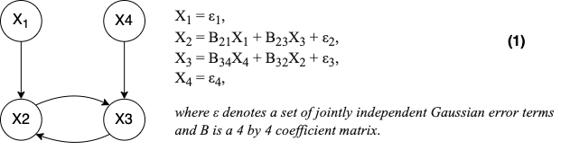
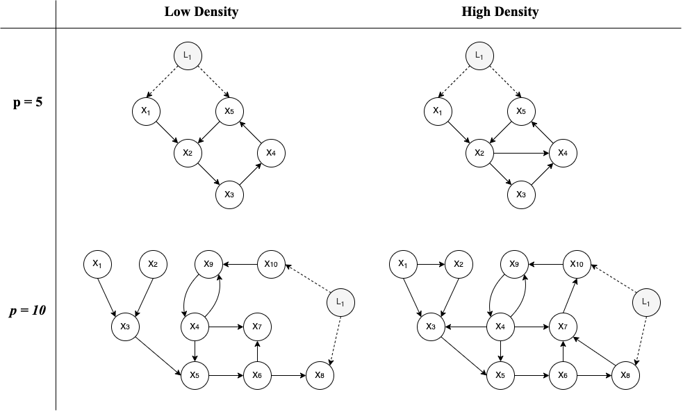

---
output:
  bookdown::pdf_document2:
    number_sections: true
    highlight: pygments
    toc: false
    keep_tex: true
    #citation_package: biblatex
    pandoc_args: ["--biblatex"]
csl: "apa.csl"
link-citations: yes

geometry: margin = 2cm
#fontsize: 11.5pt
mainfont: Calibri
sansfont: Calibri
indent: true
header-includes:
  - \usepackage{indentfirst, graphicx, caption, setspace, floatrow}
  - \usepackage{setspace}\spacing{1.5}
  - \setlength{\skip\footins}{0.5cm}
  #- \setlength{\footnotesep}{0.1mm}
  #- \usepackage{setspace}\setlength{\footnotemargin}{2mm}
  #- \usepackage{footmisc}{\footnotelayout}{\setstretch{0.2}}
  - \captionsetup[table]{skip=5pt}
  - \usepackage[singlelinecheck=false]{caption}
  
  - \floatsetup[figure]{capposition=top}
  - \floatsetup[table]{capposition=top}
  
  - \usepackage[labelfont=bf]{caption}

  - \include{preamble.tex}
  #- \usepackage{floatrow}
  #- \floatsetup[figure]{capposition=top}
---
```{r setup, include=FALSE}
knitr::opts_chunk$set(echo = TRUE)
library(papaja)
library(dplyr)
library(kableExtra)
```

<!-- start frontpage -->
\pagenumbering{gobble}
\Large Thesis Proposal

\begin{centering}
\vspace{3cm}
\Huge
{\bf Discovering Cyclic Causal Models in Psychological Research}

\vspace{3cm}
\Large
Kyuri Park (5439043)

Supervisor: Oisín Ryan

\vspace{1cm}

\Large
\textit{Methodology and Statistics for the Behavioural, Biomedical and Social Sciences \\ Utrecht University}

% bottom-center page
\vspace{1cm}
October 13, 2022

\large Word count: 748  

\large FETC-approved: 22-1825
\vspace{1cm}

\large \textit {Candidate journal: Multivariate Behavioral Research, Psychological Methods}

\vspace{-0.5cm}
\hspace{1.5cm}
\includegraphics[width=8cm]{img/UU_logo.png}

\end{centering}
<!-- end frontpage -->

\newpage
\pagenumbering{arabic}
\newgeometry{left=3cm, right=3cm, top=3cm, bottom=3cm}
\normalsize

# Introduction
## Background
In many scientific fields, empirical researchers aim to gain insights into causal mechanisms by fitting statistical models to observational data. In psychology, for example, the network theory of psychopathology posits that mental disorder is produced by a system of direct and mutual causal interactions between symptoms [@BorsboomCramer2013]. In practice, researchers aim to gain insight into these causal relations by fitting statistical network models to cross-sectional data [@robinaugh2020]. However, it has been shown that statistical network models are likely to perform poorly for discovering causal relationships, since relations in the network can be produced by unwittingly conditioning on common effects between other variables in the network [@Ryan2022].

@Ryan2022 suggest that network models could in principle be replaced by using purpose-built causal discovery (CD) algorithms developed in the field of graphical causal modeling [@spirtes_algorithm_1991]. However, the most popular and well-studied CD algorithms assume that causal relationships are acyclic [@Glymour2019]; if X causes Y then Y does not cause X. This is counter to our expectations in psychological settings, necessitating the use of cyclic causal discovery (CCD) algorithms [@richardson1996]. Cyclic causal discovery algorithms are, however, more difficult to apply and interpret [@Bongers2021], and little research has been done on their performance in settings we would expect to encounter in psychological research.

## Current Project
To reflect the study designs that are often encountered in psychological network research, we employ simulations where we vary sample sizes, density (i.e., number of causal relationships), and presence of unobserved confounders. We expect most algorithms would perform well in situations where the sample size is sufficiently large, density is low, and unobserved confounders are absent. Such situations are rare in psychological research, which brings the challenge and hence it is of interest to investigate the performance of algorithms under the typical psychological settings (i.e., low sample size, high density, presence of confounders). Thus, the research question this project addresses is: *how well do cyclic causal discovery algorithms perform in typical psychological research contexts?*

\newpage
# Analytical strategy
We examine the performance of algorithms across different conditions, then we provide an empirical example by applying the best-performing algorithm to a psychological data set.
The general approach to the simulation studies is as follows:  

First, we specify a cyclic causal graphical model (CCGM) that represents causal relationships between variables. See Figure \@ref(fig:cyclicgraph) for the example CCGM, which consists of four *nodes* (variables involved) and four *edges* (direct causal effects).
	
Second, we define a functional form for the causal relationships as a (non-recursive) structural equation model with independent error terms. Here, we focus on the sub-cases of causal models, where all variables are linearly related with Gaussian error terms in order to maximize the comparability with linear statistical network models. See below the structural equations (1) for the associated CCGM.	

```{r cyclicgraph}
#| echo = FALSE, dpi=300, out.width="80%",
#| fig.cap="(ref:cyclicgraph)",
#| fig.align="center"


```
(ref:cyclicgraph) *Example cyclic causal graph model (CCGM) and the corresponding structural equations.*	
	


Third, we generate data by sampling Gaussian error terms and solving the system of equations.^[$\mathbf {X = (I - B)^{-1} \varepsilon}$, where $\mathbf I$ denotes the identity matrix]

Fourth, we run the algorithms and estimate the causal model using the open-source software *Tetrad* [@TETRAD], R package `rcausal` [@rcausal]  and `CCI` [@cci]. We consider the following four algorithms: *Cyclic Causal Discovery* [@Richardson1996a], *Greedy Equivalence Search* [@chickering2002], *Fast Causal Inference* [@spirtes2000], and *Cyclic Causal Inference* [@strobl2019]. See Table 1 for the overview of the algorithms.

```{r tab1, echo=FALSE}
tab_01 = data.frame(
  Algorithm = c("Cyclic Causal Discovery (CCD)", "Greedy Equivalence Search (GES)", "Fast Causal Inference (FCI)", "Cyclic Causal Inference (CCI)"),
  Constraint = c("o", " ", "o", "o"),
  Score = c("", "o", "", ""),
  Sufficiency = c("o", "o", "", ""),
  Cyclic = c("o", " ", "", "o")
)

knitr::kable(
  tab_01,
  format = "latex",
  booktabs = TRUE,
  escape = FALSE,
  col.names =  c("Algorithm", "Constraint-based", "Score-based", "Causal sufficiency", "Cyclic structure"),
  align = c("l", "c", "c", "c", "c"),
  caption = "Overview of algorithms"
  ) %>% 
  row_spec(0, bold=TRUE) %>% 
  kable_styling(latex_options= "HOLD_position", font_size = 8) %>% 
  #footnote(general_title = "Note.", general=c("Requirement of causal sufficiency assumption: x = yes; otherwise = no", "Capability of inferring cyclic structure: x = yes; otherwise = no"), threeparttable = TRUE, footnote_as_chunk = TRUE, fixed_small_size = TRUE, escape = F) 
  add_footnote(c("Note. Requirement of causal sufficiency assumption: o = yes; otherwise = no.", "Capability of inferring cyclic structure: o = yes; otherwise = no."), notation = "none")
```

\newpage
We evaluate the performance of algorithms based on the comparison between the resulting causal graph and the true data generating causal model. Overall performance is assessed with Matthew’s correlation coefficient (MCC), as MCC gives a good indication of performance by taking both true and false positives/negatives into account [@Kossakowski2021]. In addition, we check to what degree the Markov equivalence class contains the true model and how big the equivalence class is to gauge the specificity of algorithms.

In the simulation study, we generate different types of causal models by varying the number of variables (rows of Figure \@ref(fig:simsettings)) and density (columns of Figure \@ref(fig:simsettings)). We vary the sample size in the data across the range we encounter in psychological network ($n = 100,\ 350, \ 1000$). Finally, we examine the ability of each method to deal with the presence of unobserved confounding by adding a latent confounder to each causal graph (node $L$ in Figure \@ref(fig:simsettings)). This gives us a $2 \times 2 \times 3 \times 2$ design (Variables $\times$ Density $\times$ Sample Size $\times$ Confounding: *Yes/No*) design. 

\vspace{0.3cm}

```{r simsettings}
#| echo = FALSE, dpi=300, out.width="100%",
#| fig.cap = "(ref:simsettings)"


```
(ref:simsettings) *Simulation design.*  

\vspace{-0.5cm}
\small *Note.* *X* represents observed variables. *L* represents an unobserved confounder.


\vspace{0.5cm}
In the empirical example analysis, we use the data from @mcnally2017 that are publicly available. This data contain responses on 26 symptom variables from 408 OCD patients with co-morbid diagnosis of depression. We apply the best-performing algorithm found from the simulations and estimate the causal structure accordingly.^[Ethical consent has been provided by FERB.]


\newpage

\nocite{*}
\printbibliography[keyword=main, title={References}]
\printbibliography[notkeyword=main, title={Additional references}]


\vspace{10cm}